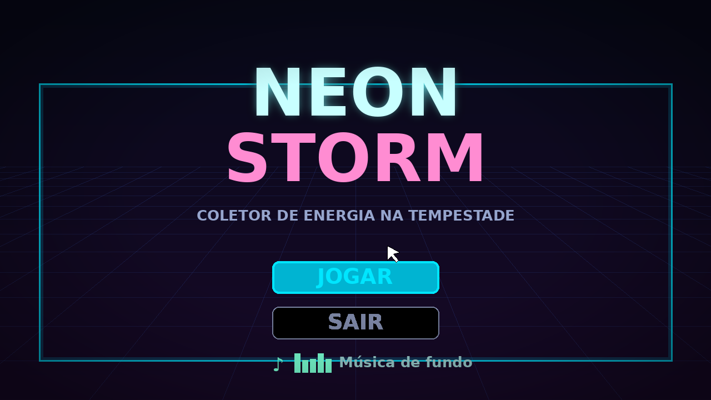
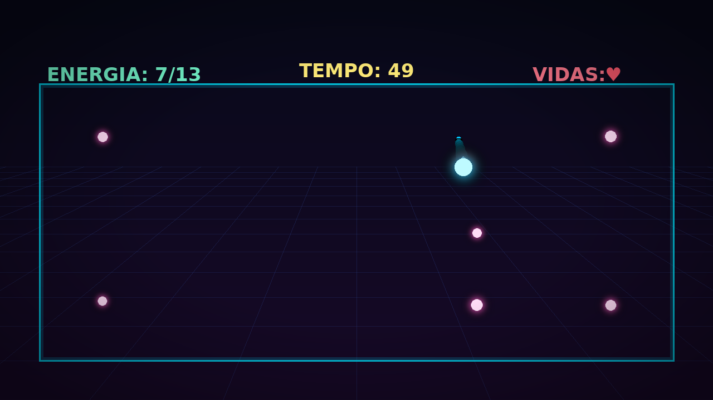
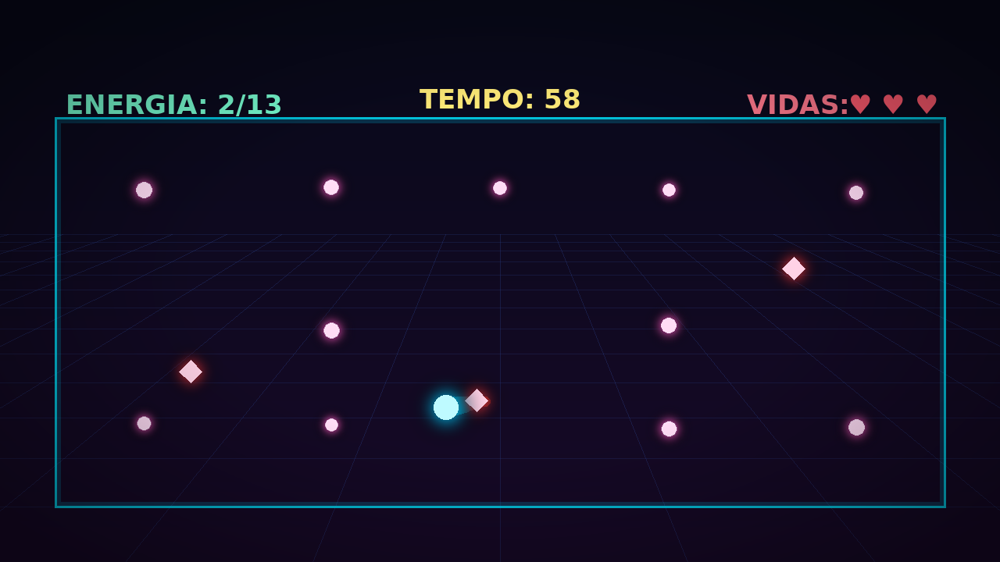

# NEON STORM

## 👤 Autor

**Nome:** Túlio Teixeira Silva
**RA:** 24811

---

## 🎮 Descrição do jogo

**NEON STORM** é um jogo 3D de arena no estilo *collectathon* com tempo. Você controla
uma esfera de energia presa em uma arena neon e precisa **coletar todas as células de
energia (orbs) antes que o tempo acabe**, enquanto desvia das **Sentinelas** — inimigos
que perseguem o jogador e tiram suas vidas ao encostar.

Para aumentar a imersão, a arena tem um **clima dinâmico**: a chuva começa e para
sozinha em intervalos aleatórios, mudando a atmosfera de cada partida.

**Objetivo:** colete todos os orbs antes do tempo zerar e sem perder todas as vidas.
- Coletou todos os orbs → **Vitória**
- Tempo acabou **ou** vidas chegaram a zero → **Derrota**

---

## 🕹️ Instruções de jogabilidade (controles)

O jogo é jogado pelo **teclado e mouse**:

| Ação | Controle |
|------|----------|
| Mover | `W` `A` `S` `D` ou as **setas** |
| Pular | `Barra de espaço` |
| Pausar / Continuar | `ESC` |
| Câmera | Terceira pessoa, segue o jogador automaticamente |
| Coletar energia | Encoste nos orbs flutuantes |

> Dica: as Sentinelas só perseguem quando você entra no raio de detecção delas — use a
> arena e o tempo entre as chuvas a seu favor.

---

## ▶️ Vídeo de gameplay

📺 **Link do vídeo:** https://youtu.be/W_P3K7Eq8UE

<!-- Para embedar a miniatura clicável, troque VIDEO_ID pelo id do seu video do YouTube:
[](https://www.youtube.com/watch?v=VIDEO_ID)
-->

---

## 🖼️ Capturas de tela

### Menu principal


### Gameplay — arena e coleta de energia


### Gameplay — perseguição das Sentinelas


---

## ⭐ Funcionalidades desenvolvidas

Além do menu com música, do HUD e da jogabilidade básica, foram desenvolvidas as
seguintes funcionalidades **novas** (destaque do trabalho):

### 1. Sistema de chuva dinâmica (clima procedural)

Foi desenvolvido um sistema que **liga e desliga a chuva sozinho em intervalos
aleatórios**, deixando o clima da fase imprevisível e mais imersivo. O `ParticleSystem`
é criado inteiramente por código (não precisa configurar nada na mão no editor): o
script monta o emissor, define gravidade/tamanho/cor das gotas e faz o emissor **seguir
o jogador**, para a chuva cobrir sempre a área onde ele está. A cada ciclo, o sistema
sorteia quanto tempo vai ficar seco ou chovendo.

```csharp
// RainSystem.cs (trecho principal)
void Start()
{
    CriarParticulas();
    DefinirChuva(false);   // comeca seco
    AgendarTroca();
}

void Update()
{
    // mantem o emissor acima do jogador
    GameObject jog = GameObject.FindGameObjectWithTag("Player");
    if (jog != null)
        transform.position = new Vector3(jog.transform.position.x, alturaSpawn, jog.transform.position.z);

    // alterna chuva/seco quando o tempo agendado chega
    if (Time.time >= proximaTroca)
    {
        DefinirChuva(!chovendo);
        AgendarTroca();
    }
}

void DefinirChuva(bool ligar)
{
    chovendo = ligar;
    emissao.rateOverTime = ligar ? particulasPorSegundo : 0f;   // 0 = sem gotas
    if (somChuva != null)
    {
        if (ligar && !somChuva.isPlaying) somChuva.Play();
        else if (!ligar && somChuva.isPlaying) somChuva.Stop();
    }
}

void AgendarTroca()
{
    // sorteia a duracao do proximo periodo (seco ou chuvoso)
    float dur = chovendo ? Random.Range(minChuva, maxChuva)
                         : Random.Range(minSeco, maxSeco);
    proximaTroca = Time.time + dur;
}
```

**Print da chuva no jogo:**


---

### 2. IA de inimigos perseguidores (Sentinelas)

Foi desenvolvida uma **inteligência artificial de perseguição** para os inimigos. Cada
Sentinela procura o jogador pela *tag*, e **só começa a perseguir quando o jogador entra
no seu raio de detecção**. A partir daí ela se move e gira em direção ao jogador no plano
do chão. Ao encostar, causa dano (perde uma vida no `GameManager`), **com um cooldown**
para não tirar todas as vidas de uma vez, e ainda **empurra o jogador** para dar feedback
e dar chance de fuga.

```csharp
// EnemyAI.cs (trecho principal)
void Update()
{
    if (jogador == null) return;
    if (GameManager.Instance != null && GameManager.Instance.FimDeJogo) return;

    float distancia = Vector3.Distance(transform.position, jogador.position);
    if (distancia > raioDeteccao) return; // jogador fora do alcance: nao persegue

    Vector3 direcao = jogador.position - transform.position;
    direcao.y = 0f;
    direcao.Normalize();

    // move em direcao ao jogador e vira para ele
    transform.position += direcao * velocidade * Time.deltaTime;
    if (direcao.sqrMagnitude > 0.01f)
        transform.rotation = Quaternion.Slerp(
            transform.rotation, Quaternion.LookRotation(direcao), 8f * Time.deltaTime);
}

void TentarDanificar(Collider other)
{
    if (!other.CompareTag("Player")) return;
    if (Time.time < proximoDano) return;     // respeita o cooldown de dano
    proximoDano = Time.time + intervaloDano;

    if (GameManager.Instance != null) GameManager.Instance.PerderVida();

    // empurrao para dar feedback ao jogador
    Rigidbody rbJog = other.attachedRigidbody;
    if (rbJog != null)
    {
        Vector3 empurrao = (other.transform.position - transform.position).normalized;
        empurrao.y = 0.4f;
        rbJog.AddForce(empurrao * forcaEmpurrao, ForceMode.Impulse);
    }
}
```

**Print das Sentinelas perseguindo o jogador:**


---

### (Bônus) 3. Coleta de energia com pontuação e condição de vitória

Os orbs flutuam e giram, e ao serem tocados somam pontos no `GameManager`, que atualiza
o HUD e dispara a vitória quando todos são coletados.

```csharp
// Collectible.cs (trecho)
void OnTriggerEnter(Collider other)
{
    if (!other.CompareTag("Player")) return;
    if (GameManager.Instance != null) GameManager.Instance.ColetarOrb();
    if (somColeta != null) AudioSource.PlayClipAtPoint(somColeta, transform.position);
    if (efeitoColeta != null) Instantiate(efeitoColeta, transform.position, Quaternion.identity);
    Destroy(gameObject);
}
```

---

## 🛠️ Como rodar o projeto

1. Abra o projeto no **Unity** (recomendado Unity 2021.3 LTS ou mais recente).
2. Abra a cena **`Menu`** e adicione `Menu` e `Game` em *File → Build Settings → Scenes in Build* (nesta ordem).
3. Aperte **Play** no menu e clique em **Jogar**.

O passo a passo completo de montagem das cenas (tags, HUD, áudio, spawn de orbs/inimigos)
está em **[`docs/CONFIGURACAO_UNITY.md`](docs/CONFIGURACAO_UNITY.md)**.

---

## 📂 Estrutura do projeto

```
NEON-STORM/
├── Assets/
│   └── Scripts/
│       ├── GameManager.cs       # estado da partida, HUD, vitoria/derrota
│       ├── PlayerController.cs   # movimentacao do jogador (teclado)
│       ├── CameraFollow.cs       # camera em 3a pessoa
│       ├── Collectible.cs        # orbs de energia
│       ├── EnemyAI.cs            # IA de perseguicao das Sentinelas  (Funcionalidade 2)
│       ├── RainSystem.cs         # sistema de chuva dinamica         (Funcionalidade 1)
│       ├── MainMenu.cs           # botoes do menu
│       ├── BackgroundMusic.cs    # musica de fundo em loop
│       ├── PauseMenu.cs          # pausa com ESC
│       └── Bootstrap.cs          # (opcional) spawn de orbs/inimigos
├── Imagens/                      # prints usados neste README
├── docs/
│   └── CONFIGURACAO_UNITY.md     # guia de montagem das cenas
├── .gitignore                    # gitignore especifico do Unity
└── README.md
```

---

